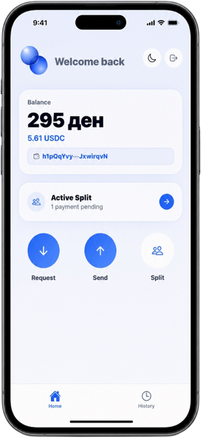

#  Pola

<table>
<tr>
<td width="40%" valign="top">

A mobile payment app built on Solana. Connect your Phantom wallet, send and request USDC, and split bills with friends - each person gets their own Solana Pay QR code.

Built with Expo (React Native) as a fintech demo showcasing how blockchain technology can solve real-world payment settlement problems.

### Features

- Connect Wallet screen with Phantom deep-link integration
- Home screen with MKD + USDC Devnet balance
- Request Money flow with Solana Pay-compatible QR code
- Send Money flow with real camera QR scanner
- Split Bill flow — each person gets their own QR code
- Real transaction history

</td>
<td width="40%" valign="middle">

</td>
</tr>
</table>

## Tech Stack

|                   |                                         |
| ----------------- | --------------------------------------- |
| Framework         | Expo SDK 54 / React Native 0.81         |
| Blockchain        | Solana Devnet (JSON-RPC)                |
| Payments          | Solana Pay transfer request spec        |
| Wallet            | Phantom deep-link integration           |
| Crypto primitives | `tweetnacl`, `bs58`                     |
| QR                | `react-native-qrcode-svg` + Expo Camera |
| Exchange rates    | open.er-api.com (USD → MKD, 5min cache) |

## Prerequisites

- [Node.js](https://nodejs.org) 18+
- [Expo Go](https://expo.dev/go) installed on your phone
- [Phantom wallet](https://phantom.app) on the same phone for live transaction flows

## Run

npm install
npx expo start --tunnel

Scan the QR code displayed in your terminal with Expo Go. Phantom wallet is required on the same device for real transaction testing.